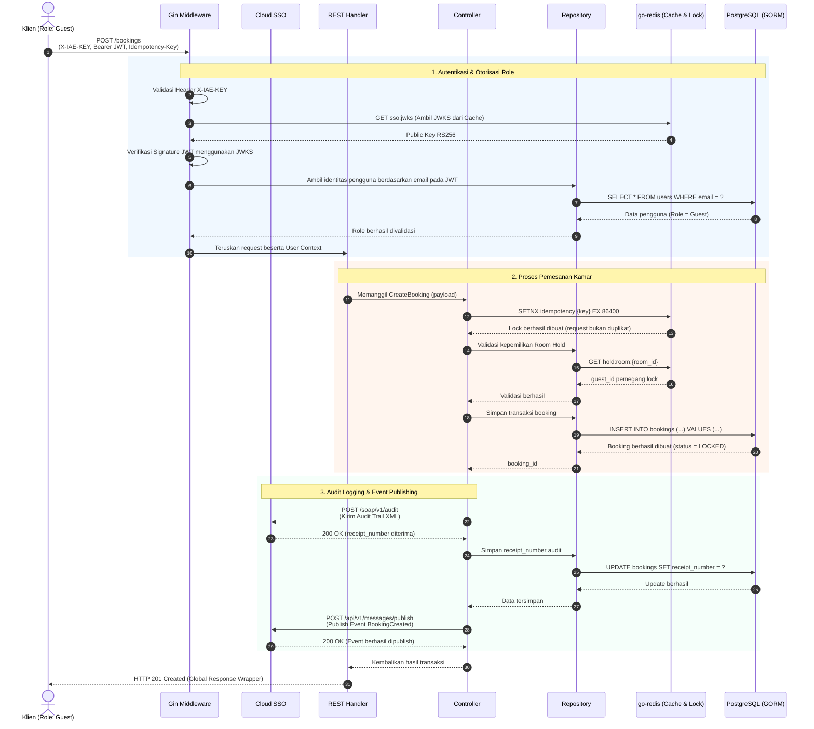

```mermaid
sequenceDiagram
    autonumber
    actor Guest as Klien (Role: Guest)
    participant MW as Gin Middleware
    participant Cloud as Cloud SSO
    participant Handler as REST Handler
    participant UC as Controller
    participant Repo as Repository
    participant Redis as go-redis (Cache & Lock)
    participant DB as PostgreSQL (GORM)

    Guest->>MW: POST /bookings <br/>(X-IAE-KEY, Bearer JWT, Idempotency-Key)

    rect rgb(240, 248, 255)
        Note over MW, DB: 1. Autentikasi & Otorisasi Role
        MW->>MW: Validasi Header X-IAE-KEY
        MW->>Redis: GET sso:jwks (Ambil JWKS dari Cache)
        Redis-->>MW: Public Key RS256
        MW->>MW: Verifikasi Signature JWT menggunakan JWKS
        MW->>Repo: Ambil identitas pengguna berdasarkan email pada JWT
        Repo->>DB: SELECT * FROM users WHERE email = ?
        DB-->>Repo: Data pengguna (Role = Guest)
        Repo-->>MW: Role berhasil divalidasi
        MW->>Handler: Teruskan request beserta User Context
    end


    rect rgb(255, 245, 238)
        Note over Handler, DB: 2. Proses Pemesanan Kamar
        Handler->>UC: Memanggil CreateBooking (payload)
        %% Validasi Idempotency
        UC->>Redis: SETNX idempotency:{key} EX 86400
        Redis-->>UC: Lock berhasil dibuat (request bukan duplikat)
        %% Validasi Hold Room
        UC->>Repo: Validasi kepemilikan Room Hold
        Repo->>Redis: GET hold:room:{room_id}
        Redis-->>Repo: guest_id pemegang lock
        Repo-->>UC: Validasi berhasil
        %% Persist Transaction
        UC->>Repo: Simpan transaksi booking
        Repo->>DB: INSERT INTO bookings (...) VALUES (...)
        DB-->>Repo: Booking berhasil dibuat (status = LOCKED)
        Repo-->>UC: booking_id
    end


    rect rgb(245, 255, 250)
        Note over UC, Cloud: 3. Audit Logging & Event Publishing
        %% SOAP Audit
        UC->>Cloud: POST /soap/v1/audit <br/>(Kirim Audit Trail XML)
        Cloud-->>UC: 200 OK (receipt_number diterima)
        %% Update Receipt
        UC->>Repo: Simpan receipt_number audit
        Repo->>DB: UPDATE bookings SET receipt_number = ?
        DB-->>Repo: Update berhasil
        Repo-->>UC: Data tersimpan
        %% Publish Event
        UC->>Cloud: POST /api/v1/messages/publish <br/>(Publish Event BookingCreated)

        Cloud-->>UC: 200 OK (Event berhasil dipublish)
    end


    UC-->>Handler: Kembalikan hasil transaksi
    Handler-->>Guest: HTTP 201 Created (Global Response Wrapper)
```
